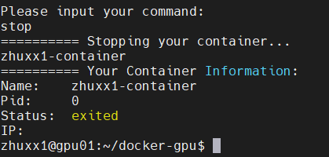

# GPU Server 使用指南

## 方案简介

由于目前组里服务器大网IP只对外开放一个端口，无法使用主流的做法，即`宿主机ip` + `分配的容器端口` 的形式直接登录容器。根据搜集到的一些同学平时的使用习惯和需求，目前决定采用下面的折中方案：

还是给用户分配可以登录到宿主机的账号；通过指定用户组等方式，对用户权限进行一定的限制，不能随意更新或者安装软件；用户自己通过执行脚本登录容器，不太需要考虑容器的用法，在容器内可以自由操纵。

后续如果各台服务器端口能够放开，会回归到这个方案。

## 概览

- 新用户需要向管理员申请用户权限，之后会分配到一个容器的SSH Port。
- 每个人对自己的Docker Container有完全的控制权限。
- 物理机的资源（磁盘、内存、显卡）是所有Docker Container共用的。
- 基础镜像为nvidia/cuda:10.1-cudnn7-runtime-ubuntu18.04，即容器预装好了Ubuntu 18.04.5 LTS，显卡驱动450.102.04以及CUDA 10.1。
- 容器内安装了常用的库：apt-utils, vim, openssh-server, net-tools, iputils-ping, wget, curl, git, iptables, bzip2, command-not-found。
- 容器内安装了Miniconda v4.9.2, 附带了一个名为py37的conda虚拟环境。

## 常用操作

### 一、容器操作

#### 1、容器启动脚本位置

使用分配的账号登录服务器：

```shell
ssh user@gpu-server-ip -p gpu-server-port
```

进入用户家目录下 _docker-gpu_ 目录，即/home/\$USER/docker-gpu，执行 _./login.bash_：

```shell
cd docker-gpu && ./login.bash
```

即可进入容器启动界面，根据提示可以启动/停止/重启容器。其他功能陆续更新中。

#### 2、启动 Docker Container

第一次登录时，会自动创建Docker Container。后续登录时如果Container没有启动，则会自动开启，并显示当前容器状态。


#### 3、进入 Docker Container

根据提示输入：_login_

```shell
Please input your command:
login
```

输入容器root账号的密码（默认123456），即可进入容器，大家就可以自由发挥，配置自己需要的环境和软件。

建议进入容器后立即修改自己的密码。


#### 4、关闭 Docker Container

根据提示输入：_stop_

```shell
Please input your command:
stop
```

即可手动关闭自己的容器。



#### 5、重启 Docker Container

根据提示输入：_restart_

```shell
Please input your command:
restart
```

即可手动关闭自己的容器。

### 二、目录挂载说明

容器启动默认挂载两个宿主机目录。

- 本地磁盘，用户家目录：/home/\$USER :/home/\$USER
- 数据盘(建议把数据放在这个下边)，各服务器挂载形式如下：
  服务器 | 目录挂载
  ---------|----------
  gpu01 | /data:/data
  gpu03 | /mnt:/mnt

**使用容器时，容器中的数据需要保留时需要写在这两个目录下面，否则容器删除重建时数据会丢失。**

### 三、如果在容器内使用GUI?

由于dockerfile目前没有预置该功能，需要用户额外进行如下操作：

- 使用 `ssh -X` 来访问容器，目前启动脚本中默认带了 `-X` 参数，不需要额外设置；
- 在容器内安装 `xauth`：
  
  ```shell
  sudo apt install xauth  # if not installed
  ```

- 在/etc/ssh/sshd配置文件中加入下面这几行：
  
  ```shell
  vi /etc/ssh/sshd_config
  X11Forwarding yes  # add
  X11UseLocalhost no  # add

  /etc/init.d/ssh restart  # 重启SSH使设置生效
  ```

- 退出容器重新登录，就可以将远程的 GUI 放在本地显示了。

  ```shell
  apt-get install x11-apps  # if not installed
  xeyes  # for example
  xeyes &  # or you can run in backround
  ```

---

## 服务器信息

目前只在gpu01上使用docker gpu server方案，待运行稳定、可靠、适用之后再考虑到迁移到gpu02和gpu03。

### 服务器列表

Name | IP | CPU | GPU | Memory | Hardware
---------|----------|---------|---------|---------|---------
 gpu01 | 10.10.49.174 | i9-9960X / 3.10GHz | GeForce RTX 2080Ti * 4 | 16GB * 8 | 4T HDD + 512GB SDD
 gpu02 | 10.10.49.172 | i9-9960X / 3.10GHz | GeForce RTX 2080Ti * 4 | 16GB * 8 | 4T HDD + 512GB SDD
 gpu03 | 10.10.49.173 |  |  |  |

### 用户列表

gpu01用户列表：

username | gpu01 port
---------|----------
 zhangyiteng | 22000
 liyouhua | 22004
 lethe | 22005
 xuewen | 22006
 colocasia |22009
 lxy | 22010
 BingQian | 22011

gpu03用户列表：

username | gpu03 port | gpu03 reserverd ports
---------|----------|----------
 liyouhua | 22000 | 18000 18001
